# SportsAnalytics-CV

**Real-Time Sports Analytics with Computer Vision and Deep Learning**

[](https://www.python.org/downloads/)
[](https://ultralytics.com/)
[](LICENSE)
[](docker/)
[](.github/workflows/)

SportsAnalytics-CV is a production-grade computer vision system for real-time sports video analysis. Built on YOLO v8/v11 and OpenCV, it performs player tracking, team classification, ball possession analysis, speed estimation, and generates comprehensive match statistics.

---

## Table of Contents

- [Overview](#overview)
- [Key Features](#key-features)
- [Architecture](#architecture)
- [Quick Start](#quick-start)
- [Installation](#installation)
- [Usage](#usage)
- [API Reference](#api-reference)
- [Performance](#performance)
- [Deployment](#deployment)
- [Datasets](#datasets)
- [Contributing](#contributing)
- [License](#license)
- [Author](#author)

---

## Overview

SportsAnalytics-CV transforms raw sports footage into actionable insights through advanced computer vision techniques.

### Use Cases

- **Match Analysis**: Comprehensive post-match statistics and visualizations
- **Performance Tracking**: Player speed, distance covered, and positioning
- **Team Analytics**: Ball possession percentages and team dynamics
- **Broadcasting**: Real-time overlays for live sports coverage
- **Coaching Tools**: Training analysis and tactical insights

---

## Key Features

| Feature | Description |
|---------|-------------|
| **Multi-Object Tracking** | Simultaneous tracking of players, ball, and referees using ByteTrack |
| **Team Classification** | Automatic team assignment using K-Means jersey color clustering |
| **Ball Possession** | Frame-by-frame possession tracking with statistics |
| **Speed Estimation** | Real-time player speed calculation (km/h) |
| **Distance Tracking** | Total distance covered per player |
| **Camera Compensation** | Handles panning and zooming via optical flow |
| **View Transformation** | Bird's-eye view conversion for accurate metrics |
| **Real-Time Visualization** | Annotated video output with overlays |
| **REST API** | FastAPI backend for integration |
| **Streamlit Demo** | Interactive web interface |

---

## Architecture

### Analysis Pipeline

```mermaid
flowchart LR
    A["🎥 Video Input"] --> B["YOLO v8/v11\nObject Detection"]
    B --> C["ByteTrack\nMulti-Object Tracker"]
    C --> D["Team Classifier\nK-Means Clustering"]
    C --> E["Camera Movement\nOptical Flow"]
    E --> F["View Transformer\nPerspective Warp"]
    D --> G["Ball Possession\nAnalysis"]
    F --> H["Speed & Distance\nEstimation"]
    G --> I["Metrics Overlay\n& Annotation"]
    H --> I
    I --> J["📹 Annotated Video"]
    I --> K["📊 JSON Stats"]
    I --> L["🌐 API Response"]
```



### Data Flow — Layer by Layer


### Deployment Architecture


### Tech Stack


---

## Quick Start

### Prerequisites

- Python 3.10+
- CUDA-capable GPU (recommended)
- 8GB+ RAM

### Installation

```bash
# Clone repository
git clone https://github.com/mlvpatel/SportsAnalytics-CV.git
cd SportsAnalytics-CV

# Create virtual environment
python -m venv venv
source venv/bin/activate  # Windows: venv\Scripts\activate

# Install dependencies
pip install -r requirements.txt

# Download pre-trained model
python scripts/download_models.py
```

### Run Analysis

```bash
# Basic usage
python main.py --input data/input_videos/match.mp4 --output data/output_videos/

# With GPU acceleration
python main.py --input match.mp4 --output output/ --device cuda

# Use cached tracking data
python main.py --input match.mp4 --use-stubs
```

---

## Installation

### Method 1: pip

```bash
pip install -r requirements.txt
```

### Method 2: Docker

```bash
docker build -t sportsanalytics-cv:latest -f docker/Dockerfile .
docker run --gpus all -v $(pwd)/data:/app/data sportsanalytics-cv:latest
```

### Method 3: Docker Compose

```bash
docker-compose -f docker/docker-compose.yml up
```

---

## Usage

### Command Line Interface

```bash
# Process video file
python main.py --input video.mp4 --output results/

# Export statistics to JSON
python main.py --input video.mp4 --export-stats stats.json

# With custom confidence threshold
python main.py --input video.mp4 --conf 0.6
```

### Python API

```python
from main import SportsAnalyzer

# Initialize analyzer
analyzer = SportsAnalyzer(
    model_path="models/yolov8x.pt",
    device="cuda"
)

# Process video
result = analyzer.analyze(
    video_path="match.mp4",
    output_path="output.mp4",
    export_stats=True
)

# Access statistics
print(f"Team 1 Possession: {result.team1_possession:.1f}%")
print(f"Team 2 Possession: {result.team2_possession:.1f}%")
```

### Streamlit Demo

```bash
streamlit run app.py --server.port 8501
```

### REST API

```bash
# Start API server
uvicorn src.api.main:app --reload --port 8000

# Submit a video for analysis
curl -X POST "http://localhost:8000/analyze" \
  -H "Content-Type: application/json" \
  -d '{"video_path": "data/input_videos/match.mp4"}'
```

---

## API Reference

### Endpoints

| Endpoint | Method | Description |
|----------|--------|-------------|
| `/analyze` | POST | Submit video for analysis |
| `/status/{job_id}` | GET | Get analysis status |
| `/jobs/{job_id}` | DELETE | Delete completed job |
| `/health` | GET | Health check |

### Response Schema

```json
{
  "job_id": "uuid",
  "status": "completed",
  "results": {
    "team1_possession": 54.2,
    "team2_possession": 45.8,
    "total_frames": 1500,
    "processing_time": 45.2,
    "player_stats": {}
  }
}
```

---

## Performance

### Benchmarks (NVIDIA RTX 3080)

| Resolution | Model | FPS | mAP |
|------------|-------|-----|-----|
| 1080p | YOLOv8n | 120+ | 89.2% |
| 1080p | YOLOv8m | 85 | 92.1% |
| 1080p | YOLOv8x | 45 | 94.5% |
| 4K | YOLOv8x | 25 | 93.8% |

### Optimization Tips

- Use TensorRT for 2x speedup on NVIDIA GPUs
- Enable half-precision (FP16) for faster inference
- Use `--use-stubs` for repeated analysis of same video

---

## Deployment

### Docker

```bash
docker build -t sportsanalytics-cv:latest .
docker run --gpus all -p 8000:8000 sportsanalytics-cv:latest
```

### Kubernetes

```bash
kubectl apply -f k8s/
```

### Cloud Platforms

| Platform | Service | Configuration |
|----------|---------|---------------|
| AWS | SageMaker | `configs/aws_sagemaker.yaml` |
| GCP | Vertex AI | `configs/gcp_vertex.yaml` |
| Azure | ML | `configs/azure_ml.yaml` |

---

## Datasets

### Recommended Datasets

| Dataset | Description | Link |
|---------|-------------|------|
| Football Players Detection | Roboflow annotated | [Roboflow](https://universe.roboflow.com/roboflow-jvuqo/football-players-detection-3zvbc) |
| SoccerNet | Large-scale soccer | [SoccerNet](https://www.soccer-net.org/) |
| DFL Bundesliga | Kaggle competition | [Kaggle](https://www.kaggle.com/competitions/dfl-bundesliga-data-shootout) |

### Custom Training

```bash
python scripts/train.py --data data/custom_dataset --epochs 100 --model yolov8x
```

---

## Project Structure

```
SportsAnalytics-CV/
├── src/                          # Source code
│   ├── trackers/                 # Object tracking (ByteTrack)
│   ├── team_assigner/            # Team classification (K-Means)
│   ├── player_ball_assigner/     # Ball possession logic
│   ├── camera_movement/          # Camera compensation (optical flow)
│   ├── view_transformer/         # Perspective transform
│   ├── speed_distance/           # Speed & distance estimation
│   ├── utils/                    # Config, video I/O, bbox helpers
│   ├── api/                      # FastAPI REST backend
│   └── worker.py                 # Celery worker entry point
├── tests/                        # 71+ unit tests (pytest)
├── docker/                       # Dockerfile & docker-compose.yml
├── .github/                      # CI/CD, Dependabot, CodeQL, templates
├── models/                       # Pre-trained YOLO weights
├── stubs/                        # Cached tracking data for fast re-runs
├── data/                         # Input/output videos & sample frames
├── notebooks/                    # Jupyter notebooks
├── docs/                         # Extended documentation
├── configs/                      # YAML configuration files
├── scripts/                      # Utility scripts (model download)
├── main.py                       # CLI entry point
├── app.py                        # Streamlit demo UI
├── pyproject.toml                # Tool config (black, isort, pytest)
├── requirements.txt              # Production dependencies
├── requirements-dev.txt          # Dev/test dependencies
├── Makefile                      # lint, format, test, docker shortcuts
├── SECURITY.md                   # Vulnerability reporting policy
├── CHANGELOG.md                  # Version history
├── CONTRIBUTING.md               # Contribution guide
├── LICENSE                       # MIT License
└── README.md                     # This file
```

---

## Contributing

1. Fork the repository
2. Create feature branch (`git checkout -b feature/AmazingFeature`)
3. Commit changes (`git commit -m 'Add AmazingFeature'`)
4. Push to branch (`git push origin feature/AmazingFeature`)
5. Open Pull Request

---

## License

MIT License - see [LICENSE](LICENSE) file.

---

## Author

**Malav Patel**

- GitHub: [@mlvpatel](https://github.com/mlvpatel)
- LinkedIn: [malavpatel112](https://linkedin.com/in/malavpatel112)
- Email: malav.patel203@gmail.com

---

## Citation

```bibtex
@software{sportsanalytics_cv_2026,
  author = {Patel, Malav},
  title = {SportsAnalytics-CV: Real-Time Sports Analytics},
  year = {2026},
  publisher = {GitHub},
  url = {https://github.com/mlvpatel/SportsAnalytics-CV}
}
```

---

**Star this repo if you find it helpful!**
